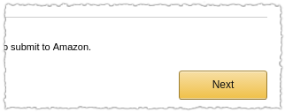

# Alexa Quickstart for Java

Create and deploy your first Amazon Echo (Alexa) Skill in five minutes or less!

After deploying your skill and configuring it in the Amazon Developer portal,
you will be able to hold a simple conversation with Alexa:

> You: "Alexa, ask my favorite color."
> 
> Alexa: "Tell me your favorite color."
> 
> You: "Red."
> 
> Alexa: ...

Alexa's brain is in the cloud, and your Alexa Skill will be no different. It
will be deployed to AWS Lambda.

## Prerequisites

To successfully deploy and use your skill:
 
 1. Your Echo (or Echo Dot) must be physically set up and connected to the
    Internet, and associated with your Amazon account.
 1. AWS must be usable with your (same) Amazon account, and you need to have
    AWS credentials configured on the computer where you will be working on this
    project (for instance, you may use the file `$HOME/.aws/credentials`, or
    environment variables, or another mechanism; see this
    [AWS article](https://aws.amazon.com/blogs/security/a-new-and-standardized-way-to-manage-credentials-in-the-aws-sdks/)
    and the [Developer Guide](http://docs.aws.amazon.com/sdk-for-java/v1/developer-guide/credentials.html)
    for details).
 1. A Java 8 JDK must be installed and configured appropriately for your system
    (e.g., `JAVA_HOME` set, `$JAVA_HOME/bin` on your path).

## Quick Steps

If you're fairly good at navigating through Web interfaces (like the
[Amazon Developer portal](https://developer.amazon.com/) we'll be using), you
can just follow the simple textual steps here. If you need more help, including
screenshots, go to [Full Steps](#full-steps).

 1. Go to your
    [Alexa Skills Kit list in the Amazon Developer portal](https://developer.amazon.com/edw/home.html#/skills/list).
 1. Click *Add a New Skill*.
 1. Enter **Favorite Color** as the *Name*, and **my favorite color** as the
    *Invocation Name*.
 1. Click *Save*, then click *Next*.
 1. Copy your skill's app ID (near the top of the screen - it looks like
    `amzn1.ask.skill.xxxxx`) and paste it into the
    [src/main/resources/app-id.properties](src/main/resources/app-id.properties)
    file in your Java project.
 1. Using [skill-data.txt](skill-data.txt) in your Java project as a source for
    copying data:
    1. Copy and paste the *Intent Schema* JSON.
    1. Add a new *Custom Slot Type* named `COLOR`; copy and paste the list of
       colors.
    1. Copy and paste the *Sample Utterance*.
    1. Click *Next* and wait for the model to build and the next page to appear.
 1. From a command prompt, in your Java project's directory, run
    `./gradlew alexaDeploySkill`.
 1. Copy the *Lambda ARN* printed by the Gradle build script.
 1. Back in the Amazon Developer portal, select *AWS Lambda ARN* and check
    *North America*; paste the Lambda ARN printed by the Gradle script into the
    text box.
 1. Click *Next*.

That's it! Now you can talk with Alexa. (The first time you access a new skill,
it can take a few seconds, so don't be alarmed if she doesn't respond
immediately the first time.)

Say: **Alexa, ask my favorite color**. Then just listen and respond!

## Full Steps

 1. Go to your
    [Alexa Skills Kit list in the Amazon Developer portal](https://developer.amazon.com/edw/home.html#/skills/list).
    Log in with the Amazon account to which your Echo (or Echo Dot) is attached.
    
    Even if you use the link above, Amazon probably won't take you to the Alexa
    Skills Kit list if you're redirected through the login process. In this
    case, click *ALEXA* in the top menu, then click *Get Started* on the *Alexa
    Skills Kit* item:
    
    
    
    You'll now see a list of skills (empty, if you haven't made a skill, before).
 1. Click *Add a New Skill*, in the top-right corner:
    
    
 1. Enter **Favorite Color** as the *Name*, and **my favorite color** as the
    *Invocation Name*:
    
    
    
    Leave the other settings as the defaults.
 1. Click *Save*:
    
    
 1. Click *Next*:
    
    
 1. Copy your skill's app ID (near the top of the screen - it looks like
    `amzn1.ask.skill.xxxxx`) and paste it into the
    [src/main/resources/app-id.properties](src/main/resources/app-id.properties)
    file in your Java project:
    
    
 1. Using [skill-data.txt](skill-data.txt) in your Java project as a source for
    copying data:
    1. Copy and paste the *Intent Schema* JSON.
    
       
    1. Add a new *Custom Slot Type* named `COLOR`:
       
       
       
       (Don't forget to press the *Add* button!)
    1. Copy and paste the *Sample Utterance*.
       
       
    1. Click *Next* and wait for the model to build and the next page to appear.
       
       
 1. From a command prompt, in your Java project's directory, run
    `./gradlew alexaDeploySkill` (on Linux or Mac), or
    `gradlew alexaDeploySkill` (on Windows).
 1. Copy the *Lambda ARN* printed by the Gradle build script:
    
    
 1. Back in the Amazon Developer portal, select *AWS Lambda ARN* and check
    *North America*; paste the Lambda ARN printed by the Gradle script into the
    text box:
    
    
 1. Click *Next*.
    
    

## Technical Notes

When you start fiddling with the code, here are some things to keep in mind.

### AWS Properties

There are several settings you can adjust in [aws.properties](aws.properties) to
control the Gradle script's interaction with AWS:

 * **profile-name:** Credentials profile to use if you're using a
   `$HOME/.aws/credentials` file for access to AWS; see the
   [AWS CLI User Guide](http://docs.aws.amazon.com/cli/latest/userguide/cli-multiple-profiles.html)
   for more information.
 * **lambda-function-name:** Name of the Lambda created; you would use this to
   identify your Lambda in the AWS Web Console, for instance.
 * **lambda-handler:** Fully-qualified name of a class that extends
   `SpeechletRequestStreamHandler` and will be used as the entrypoint of Alexa's
   call to your Lambda.
 * **lambda-memory-mb:** Memory allocated to the Lambda when it's running. The
   minimum amount of 128MB is more than ample for simple Speechlets like the
   example in this project. See the
   [Lambda Developer Guide](http://docs.aws.amazon.com/lambda/latest/dg/lambda-introduction-function.html)
   for more information.
 * **lambda-timeout-seconds:** Amount of time the Lambda can run before it is
   forcibly terminated (from 1 to 300 seconds). See the
   [Lambda Developer Guide](http://docs.aws.amazon.com/lambda/latest/dg/lambda-introduction-function.html)
   for more information.

## License

Alexa Quickstart for Java is licensed under the Apache 2.0 License - see the
[LICENSE.txt](LICENSE.txt) and [NOTICE.txt](NOTICE.txt) files for details.
